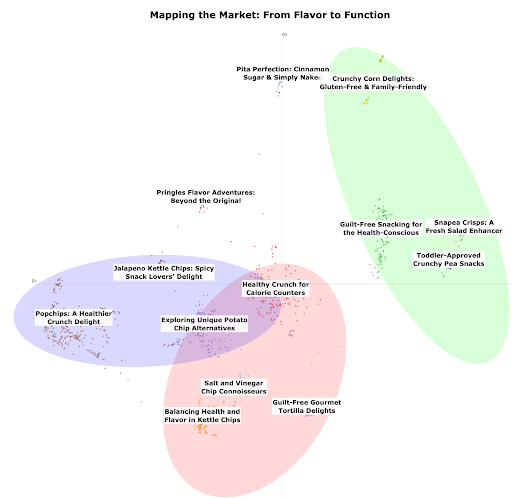
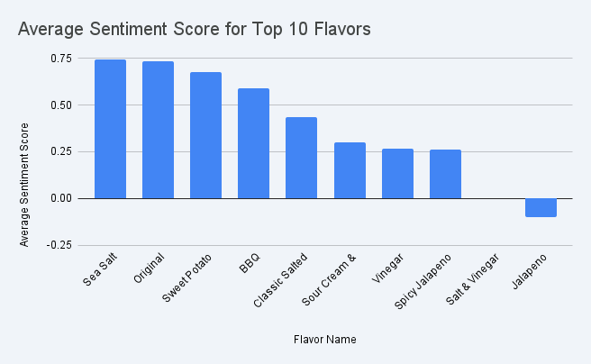
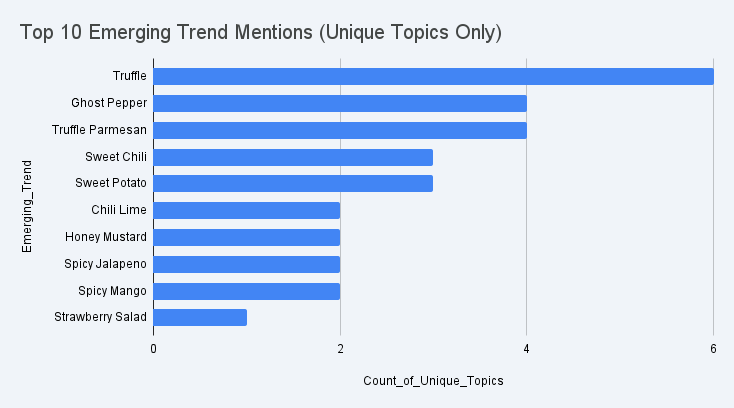

This project analyzes consumer language from [Amazon Reviews (2023)](https://amazon-reviews-2023.github.io/) and social discussions on Reddit to uncover authentic user sentiment.

It acts as a proof-of-concept for truly listening to consumer needs, exposing the critical gap between R&D innovation, marketing narratives, and actual consumer demand. 

 

### General Discussion Topics Revealed Immediately

One major benefit of the AI-powered **Topic Discovery Engine** is its ability to instantly cluster thousands of reviews into distinct themes. This visualization provides a snapshot of the current market landscape, showing exactly where your product is positioned—and uncovering critical issues that developers and marketers often overlook.

*(Above: Clustering analysis of major discussion topics)*

For example, the "Amazon Reviews on Chips" dataset reveals:

*   **Significant demand for "Better-For-You" (BFY) options:** Strong clustering around healthy alternatives like Popchips, pita chips, and Snapeas.
*   **Flavor remains king:** A large portion of consumer discourse is still dominated by flavor profiles.
*   **Packaging is a pain point:** Recurring complaints regarding package size, broken seals, crushed chips, and expiration dates. (While not visible in the scatter plot, these appear clearly in the Topic Discovery Engine results).

**Key Takeaway:** The data suggests that optimizing packaging integrity may be a "low-hanging fruit" opportunity to immediately improve sales and customer sentiment.

 

### Deep Dive into Sensory Aspects

This approach evolves beyond simple keyword counting to leverage modern NLP and LLMs, which capture the full context of consumer language. By utilizing the semantic understanding of Large Language Models, we can uncover the *true* sentiment behind flavor discussions rather than just their frequency.

*(Above: Deep dive into positive vs. negative sentiment on specific flavor profiles)*

If flavor is a priority, we can drill down to identify not just the most frequently mentioned profiles, but the specific sentiments and emerging trends driving consumer preference.

 

### Spotting Emerging Trends

If trend forecasting is the goal, we can also identify emerging flavors that are gaining traction in consumer conversations before they hit the mainstream reports.

*(Above: Identifying rising flavor keywords in recent review data)*

This approach is easily adaptable to other sources, such as Reddit, and the analysis can be tailored to address your specific research goals.

Do your products truly meet consumer needs? What insights are you missing from the authentic voice of your customer?

Reach out at **tian.yu.hank** at **gmail.com** to discuss your project.

  <iframe 
    class="w-full h-full"
    src="https://www.youtube.com/embed/slppwqCxtt0" 
    title="YouTube video player" 
    frameborder="0" 
    allow="accelerometer; autoplay; clipboard-write; encrypted-media; gyroscope; picture-in-picture; web-share" 
    referrerpolicy="strict-origin-when-cross-origin" 
    allowfullscreen>
  </iframe>

